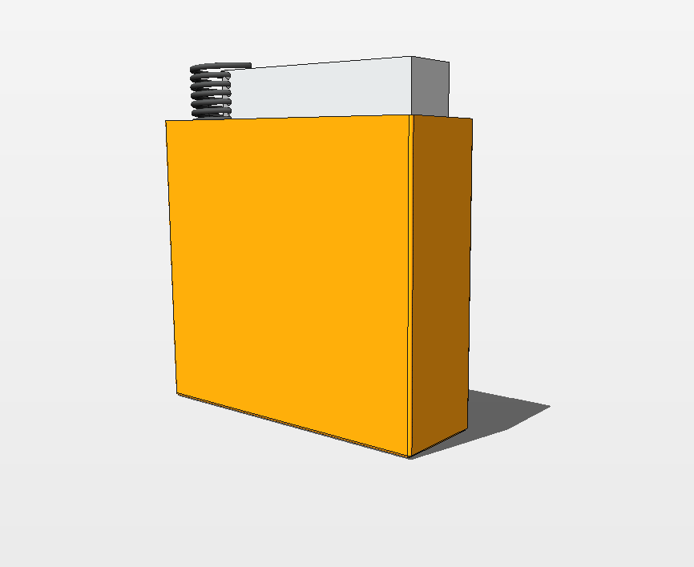
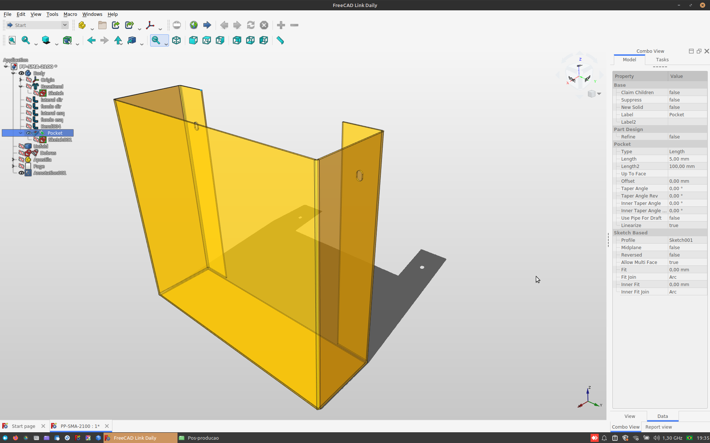
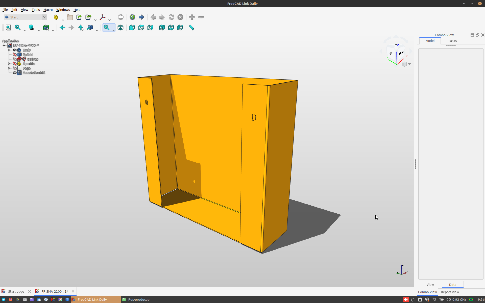
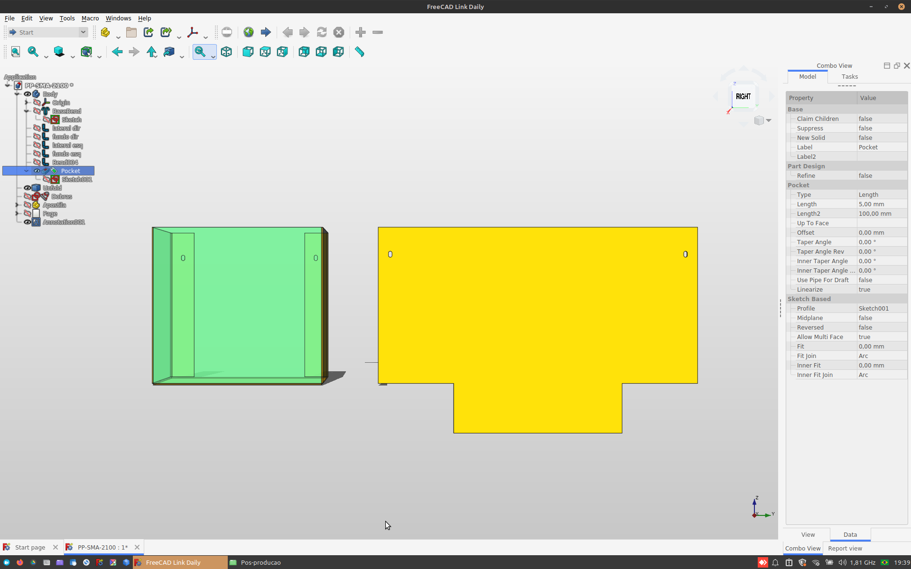
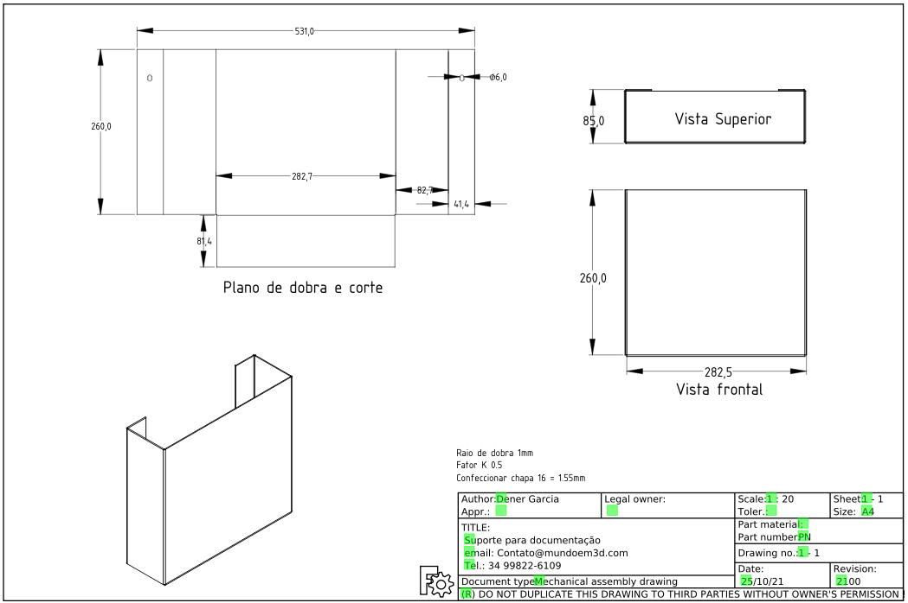
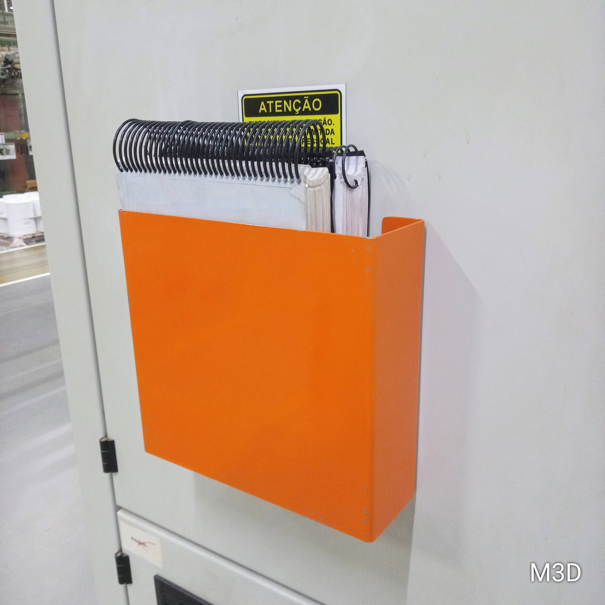

## Suporte de documentação técnica em chapa metálica

Desenvolvimento de um suporte para documentação técnica, sua principal função é ter um local adequado para disponibilizar manuais de máquinas, diagramas elétricos e instruções de trabalho.

Projeto pensado para corte a laser ou plasma e posteriormente dobrado nas devidas marcações formando a peça final.

 

Dependendo do material empregado na construção pode ser utilizado em ambientes agressivos e corrosivos.

 

Modelo é semi aberto pensando em economizar material no momento do corte.

 

Esse tipo de modelagem é pensado na forma de planificação onde após a peça ser cortada é feito as dobras necessárias até atingir a forma desejada.

 

### Resultado final
Projeto simples e funcional, como pode ser utilizado em diversos ambientes estou disponibilizando os arquivos para quem quiser replicar e utilizar no seu ambiente de trabalho, ainda é possível redimensionar e adaptar o arquivo as suas necessidades.

 

Vocẽ tem acesso aos seguintes arquivos:

- Arquivo em .step
- Arquivo nativo do Freecad
- Arquivo .dxf pronto para enviar ao corte

### 😮‍💨 Dificuldades do projeto

Modelagem com chapa metálica é sempre necessário cautela pois errando as medidas das dobras e caso o projetista erre o fator K a peça não terá as medidas conforme o projeto, sem dúvidas esse é o maior ponto de atenção.

>* [Voltar para página inicial](../README.md)
